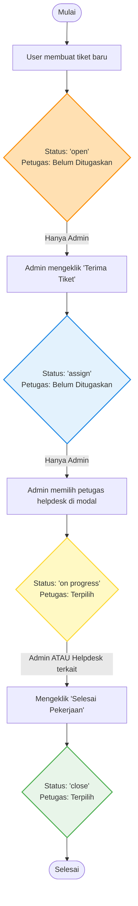
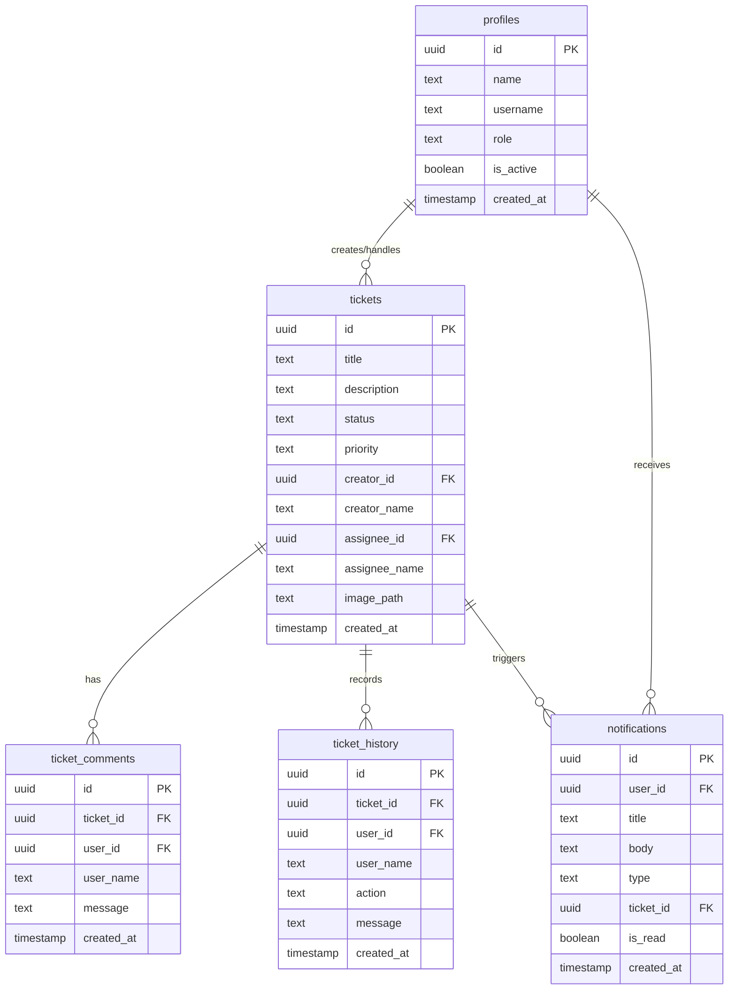

# Laporan Dokumentasi Proyek: Aplikasi E-Ticketing Helpdesk Mobile
*Dokumentasi Lengkap UAS Teori - Sistem Informasi Helpdesk Layanan IT*

---

## BAB I: PENDAHULUAN

### 1.1 Latar Belakang
Dalam lingkungan operasional organisasi modern, pengelolaan kendala teknis infrastruktur teknologi informasi (IT) membutuhkan penanganan yang cepat, terstruktur, dan transparan. Metode pelaporan kendala secara manual menggunakan pesan singkat atau memo fisik sering kali menyebabkan masalah tidak tercatat dengan baik, penugasan petugas helpdesk yang tumpang tindih, serta tidak adanya transparansi progres penyelesaian bagi pelapor.

Untuk mengatasi permasalahan tersebut, dirancanglah **Aplikasi E-Ticketing Helpdesk Mobile**. Aplikasi berbasis Android/iOS ini berfungsi sebagai pusat layanan (*Service Desk*) terintegrasi yang memfasilitasi pelaporan kendala oleh pengguna (*User*), verifikasi dan delegasi tugas oleh Administrator (*Admin*), serta eksekusi perbaikan oleh petugas lapangan (*Helpdesk*).

### 1.2 Tujuan Proyek
Proyek pembangunan aplikasi ini bertujuan untuk:
1. Menyediakan platform mobile yang memudahkan pengguna melaporkan kendala IT secara instan lengkap dengan bukti visual (lampiran gambar).
2. Membangun alur kerja (workflow) pelacakan tiket yang transparan dan disiplin dengan batasan status tersistem (*state machine*).
3. Membantu Administrator mendistribusikan penugasan kerja kepada petugas helpdesk secara efisien berdasarkan kategori masalah (Hardware, Software, Networking).
4. Menyediakan fitur rekapitulasi data dan statistik tiket yang dapat diekspor menjadi laporan PDF formal untuk keperluan audit manajemen IT.

### 1.3 Deskripsi Sistem
Aplikasi ini dikembangkan menggunakan teknologi **Flutter** (Dart) untuk bagian frontend dengan menerapkan pendekatan arsitektur bersih (*Clean Architecture*) dan pengelolaan state menggunakan **Riverpod**. Untuk backend, aplikasi ini memanfaatkan **Supabase** (PostgreSQL) sebagai penyedia layanan basis data real-time, manajemen autentikasi pengguna, penyimpanan file lampiran (*Object Storage*), serta pengiriman notifikasi instan.

---

## BAB II: ARSITEKTUR & DESAIN ALUR SISTEM

### 2.1 Alur Kerja Status Tiket (Flow Diagram)
Revisi terbaru dari dosen menetapkan bahwa alur status tiket harus berjalan secara linier dan disiplin melalui validasi sistem, menggantikan fungsionalitas pengubahan status secara bebas yang rawan penyalahgunaan. 

Berikut adalah alur perubahan status tiket yang dikontrol oleh sistem berdasarkan peran pengguna (*Role-Based Workflow*):



### 2.2 Deskripsi Role Pengguna (Aktor)
1. **User (Pengguna Biasa / Pelapor):**
   - Melaporkan kendala baru dengan judul, deskripsi, prioritas, dan foto lampiran.
   - Melihat daftar tiket miliknya dan melacak riwayat perjalanan tiket.
   - Memberikan komentar/umpan balik di dalam detail tiket.
   - Menerima notifikasi otomatis saat tiketnya direspons, ditugaskan, atau diselesaikan.
2. **Helpdesk (Petugas Teknis):**
   - Melihat daftar tiket yang ditugaskan khusus kepada dirinya.
   - Mengubah status tiket dari `on progress` menjadi `close` via tombol "Selesai Pekerjaan".
   - Melakukan diskusi dengan pelapor melalui kolom komentar tiket.
   - Menerima notifikasi instan ketika ditugaskan tiket baru oleh Admin.
3. **Admin (Administrator Utama):**
   - Memiliki kendali penuh terhadap seluruh tiket yang ada di sistem.
   - Melakukan verifikasi tiket masuk (mengubah status `open` → `assign`).
   - Melakukan delegasi tugas ke helpdesk tertentu (mengubah status `assign` → `on progress`).
   - Mengaktifkan/menonaktifkan akun pengguna di sistem (Kelola User).
   - Melakukan ekspor data rekapitulasi tiket ke dokumen laporan PDF.

### 2.3 Rencana Halaman Utama Aplikasi
Aplikasi didesain menggunakan estetika premium modern dengan fitur **Dark/Light Mode** dinamis. Halaman-halaman utama meliputi:
* **Halaman Login & Register:** Dilengkapi validasi input yang ketat dan animasi transisi yang halus.
* **Dashboard Utama:** Menyajikan metrik statistik tiket secara visual (Total Tiket, Pending, Aktif, Selesai) menggunakan kartu gradien yang disesuaikan per peran pengguna.
* **Daftar Tiket (Ticket List):** Memiliki filter bar tab (Semua, Open, Assigned, On Progress, Closed), kolom pencarian instan, serta pengurutan berdasarkan tanggal/prioritas.
* **Detail Tiket:** Menampilkan detail pelapor, petugas yang bertanggung jawab, deskripsi, lampiran gambar dengan fitur *preview zoom*, log riwayat aktivitas, serta kolom komentar obrolan real-time.
* **Notifikasi:** Menampilkan log notifikasi masuk (Tiket Baru Dibuat, Penugasan Baru, Status Diperbarui, Komentar Baru).

---

## BAB III: DATABASE & INTEGRASI BACKEND API

### 3.1 Skema Database Relasional (Supabase PostgreSQL)
Sistem menggunakan basis data relasional PostgreSQL yang di-hosting pada layanan Supabase. Skema dirancang dengan integritas data yang kuat menggunakan *Foreign Keys* dan batasan pemeriksaan (*Check Constraints*).



### 3.2 Detail Tabel dan Batasan (Constraints)
#### 1. Tabel `profiles`
Menyimpan data identitas akun pengguna dan peran otorisasi mereka.
- `id` (UUID, Primary Key, berelasi dengan tabel autentikasi Supabase `auth.users`).
- `name` (TEXT) - Nama lengkap pengguna.
- `username` (TEXT, Unique) - Nama pengguna untuk kredensial login.
- `role` (TEXT) - Batasan nilai: `'admin'`, `'helpdesk'`, `'user'`.
- `is_active` (BOOLEAN, Default: `true`) - Status keaktifan akun.

#### 2. Tabel `tickets`
Menyimpan informasi inti tiket kendala IT yang dilaporkan.
- `id` (UUID, Primary Key, Auto Generate).
- `title` (TEXT) - Judul keluhan teknis.
- `description` (TEXT) - Rincian masalah teknis.
- `status` (TEXT) - Batasan nilai (*Check Constraint* `tickets_status_check`):
  ```sql
  CHECK (status IN ('open', 'assign', 'on progress', 'close'))
  ```
- `priority` (TEXT) - Batasan nilai: `'low'`, `'medium'`, `'high'`.
- `creator_id` (UUID, Foreign Key ke `profiles.id`).
- `assignee_id` (UUID, Nullable, Foreign Key ke `profiles.id`).
- `image_path` (TEXT, Nullable) - Menyimpan URL publik file lampiran gambar dari Supabase Storage.

#### 3. Tabel `ticket_comments`
Menyimpan log diskusi obrolan per tiket.
- `ticket_id` (UUID, Foreign Key ke `tickets.id` ON DELETE CASCADE).
- `user_id` (UUID, Foreign Key ke `profiles.id`).
- `message` (TEXT) - Isi komentar.

#### 4. Tabel `ticket_history`
Menyimpan catatan riwayat perjalanan tiket untuk audit (*audit log*).
- `ticket_id` (UUID, Foreign Key ke `tickets.id` ON DELETE CASCADE).
- `action` (TEXT) - Jenis tindakan (`'dibuat'`, `'ditugaskan'`, `'status_diubah'`, `'komentar_ditambahkan'`).
- `message` (TEXT) - Deskripsi aktivitas audit log.

#### 5. Tabel `notifications`
Menyimpan pesan notifikasi yang diarahkan ke akun tertentu.
- `user_id` (UUID, Foreign Key ke `profiles.id` ON DELETE CASCADE) - Penerima notifikasi.
- `type` (TEXT) - Jenis notifikasi (`'created'`, `'status'`, `'comment'`).
- `is_read` (BOOLEAN, Default: `false`).

### 3.3 Integrasi API & Object Storage
Aplikasi mobile berkomunikasi langsung dengan Supabase API secara asinkron menggunakan protokol REST API dan WebSocket untuk pembaruan data secara real-time. Untuk lampiran gambar, file lokal diunggah ke Supabase Object Storage bucket **`ticket-attachments`** yang dikonfigurasi sebagai **Public** dengan aturan RLS (Row Level Security) sebagai berikut:
- **SELECT Policy:** `true` (Semua orang dapat membaca/mengakses file gambar melalui URL publik).
- **INSERT Policy:** `true` (Pengguna terautentikasi diizinkan mengunggah file baru).

### 3.4 Dokumentasi API Backend (Supabase REST API)
Karena Supabase secara otomatis menghasilkan RESTful API dari skema database PostgreSQL menggunakan PostgREST, aplikasi berkomunikasi menggunakan format JSON dengan parameter kueri khusus. Berikut adalah daftar endpoint API utama yang digunakan aplikasi beserta rincian request/response:

#### 1. Autentikasi Pengguna (Supabase Auth API)
* **Register Akun Baru**
  - **Endpoint:** `POST /auth/v1/signup`
  - **Payload (JSON):**
    ```json
    {
      "email": "user@example.com",
      "password": "password123",
      "data": {
        "name": "Fadhil Ilyas",
        "username": "user",
        "role": "user"
      }
    }
    ```
  - **Response (200 OK):**
    ```json
    {
      "id": "user-uuid-123",
      "email": "user@example.com",
      "created_at": "2026-07-02T12:00:00Z"
    }
    ```

* **Login Pengguna**
  - **Endpoint:** `POST /auth/v1/token?grant_type=password`
  - **Payload (JSON):**
    ```json
    {
      "email": "user@example.com",
      "password": "password123"
    }
    ```
  - **Response (200 OK):** Mengembalikan token JWT (`access_token`) untuk otentikasi Bearer pada request selanjutnya.

#### 2. Tabel Profiles (User Profiles API)
* **Ambil Semua Profil Pengguna (Hanya Admin)**
  - **Endpoint:** `GET /rest/v1/profiles?select=*`
  - **Headers:** `Authorization: Bearer <token>`, `apikey: <anon_key>`
  - **Response (200 OK):**
    ```json
    [
      {
        "id": "uuid-admin-1",
        "name": "Super Admin",
        "username": "admin",
        "role": "admin",
        "is_active": true
      }
    ]
    ```

* **Pembaruan Profil / Keaktifan Akun**
  - **Endpoint:** `PATCH /rest/v1/profiles?id=eq.{userId}`
  - **Payload (JSON):**
    ```json
    {
      "is_active": false
    }
    ```
  - **Response (204 No Content):** Pembaruan berhasil disimpan.

#### 3. Tabel Tickets (Tickets API)
* **Ambil Daftar Tiket Terintegrasi (dengan Komentar & Riwayat)**
  - **Endpoint:** `GET /rest/v1/tickets?select=*,ticket_comments(*),ticket_history(*)`
  - **Headers:** `Authorization: Bearer <token>`
  - **Response (200 OK):**
    ```json
    [
      {
        "id": "ticket-uuid-abc",
        "title": "Koneksi Printer Macet",
        "description": "Printer tidak merespon print job",
        "status": "open",
        "priority": "medium",
        "creator_id": "user-uuid-123",
        "creator_name": "Fadhil Ilyas",
        "assignee_id": null,
        "assignee_name": null,
        "image_path": "https://supabase.co/storage/v1/object/public/ticket-attachments/123.jpg",
        "created_at": "2026-07-02T12:05:00Z",
        "ticket_comments": [],
        "ticket_history": [
          {
            "id": "history-uuid-1",
            "action": "dibuat",
            "message": "Tiket berhasil dibuat oleh Fadhil Ilyas"
          }
        ]
      }
    ]
    ```

* **Buat Tiket Baru**
  - **Endpoint:** `POST /rest/v1/tickets`
  - **Payload (JSON):**
    ```json
    {
      "title": "Koneksi Printer Macet",
      "description": "Printer tidak merespon print job",
      "priority": "medium",
      "creator_id": "user-uuid-123",
      "creator_name": "Fadhil Ilyas",
      "image_path": "https://supabase.co/storage/v1/object/public/ticket-attachments/123.jpg",
      "status": "open"
    }
    ```
  - **Response (201 Created):** Mengembalikan objek tiket utuh yang baru dibuat.

* **Perbarui Status / Penugasan Tiket**
  - **Endpoint:** `PATCH /rest/v1/tickets?id=eq.{ticketId}`
  - **Payload (JSON):**
    ```json
    {
      "status": "on progress",
      "assignee_id": "helpdesk-uuid-999",
      "assignee_name": "Budi - Networking"
    }
    ```
  - **Response (204 No Content):** Tiket berhasil diperbarui.

#### 4. Tabel Ticket Comments & History (Interaksi Tiket)
* **Tambah Komentar Baru**
  - **Endpoint:** `POST /rest/v1/ticket_comments`
  - **Payload (JSON):**
    ```json
    {
      "ticket_id": "ticket-uuid-abc",
      "user_id": "helpdesk-uuid-999",
      "user_name": "Budi - Networking",
      "message": "Kabel printer sudah dicolokkan?"
    }
    ```

* **Tambah Log Riwayat Aktivitas**
  - **Endpoint:** `POST /rest/v1/ticket_history`
  - **Payload (JSON):**
    ```json
    {
      "ticket_id": "ticket-uuid-abc",
      "user_id": "admin-uuid-1",
      "user_name": "Super Admin",
      "action": "ditugaskan",
      "message": "Tiket ditugaskan kepada Budi - Networking"
    }
    ```

#### 5. Tabel Notifications (Notification API)
* **Kirim Notifikasi Baru**
  - **Endpoint:** `POST /rest/v1/notifications`
  - **Payload (JSON):**
    ```json
    {
      "user_id": "user-uuid-123",
      "title": "Status Tiket Diperbarui",
      "body": "Tiket #TICKET-AB diubah statusnya menjadi ASSIGNED",
      "type": "status",
      "ticket_id": "ticket-uuid-abc"
    }
    ```

---

## BAB IV: DESAIN UI/UX

Desain antarmuka aplikasi berfokus pada kenyamanan pengguna dengan menyajikan tata letak modern, bersih, intuitif, dan responsif. Aplikasi ini mendukung penuh **Dark Mode** dan **Light Mode** secara dinamis untuk mengoptimalkan keterbacaan dalam berbagai kondisi pencahayaan.

### 4.1 Panduan Warna (Color Palette)
Sistem warna aplikasi dibangun secara terstruktur pada file `app_colors.dart` menggunakan kombinasi kontras tinggi untuk membedakan elemen visual dengan jelas.

| Kelompok Warna | Nama Warna | Nilai Hex | Penggunaan Utama |
| :--- | :--- | :--- | :--- |
| **Brand Colors** | Primary (Indigo 600) <br> Primary Dark (Indigo 800) <br> Primary Light (Indigo 400) | `#4F46E5` <br> `#3730A3` <br> `#818CF8` | Tombol utama, header aktif, elemen fokus, & ikon utama.<br>Warna primer dalam tema gelap.<br>Aksen garis batas fokus tema gelap. |
| **Secondary & Accent**| Secondary (Sky 500) <br> Accent (Amber 500) | `#0EA5E9` <br> `#F59E0B` | Indikator visual pelengkap, info grafik.<br>Ikon lampiran, penanda prioritas tiket. |
| **Neutral Theme** | Background Light <br> Background Dark <br> Card Light <br> Card Dark | `#F8FAFC` <br> `#0B1120` <br> `#FFFFFF` <br> `#1A2235` | Latar belakang dasar aplikasi tema terang.<br>Latar belakang dasar aplikasi tema gelap.<br>Permukaan kartu tiket & modul tema terang.<br>Permukaan kartu tiket & modul tema gelap. |
| **Status (Badge)** | Status Open <br> Status Assigned <br> Status On Progress <br> Status Closed | `#F97316` <br> `#3B82F6` <br> `#F59E0B` <br> `#10B981` | Tiket baru masuk (Oranye).<br>Tiket sudah diterima admin (Biru).<br>Sedang ditangani helpdesk (Amber/Kuning).<br>Pekerjaan selesai teratasi (Hijau). |

#### Visualisasi Gradien
Sistem menggunakan beberapa gradien linier premium untuk memberikan kedalaman visual pada antarmuka:
- **`primaryGradient` (`#4F46E5` → `#7C3AED`):** Digunakan untuk latar belakang header halaman utama dan tombol kirim tiket.
- **`successGradient` (`#10B981` → `#06B6D4`):** Digunakan untuk tombol konfirmasi "Selesai Pekerjaan".
- **`premiumGradient` (`#4F46E5` → `#0EA5E9`):** Digunakan pada kartu informasi performa helpdesk.

---

### 4.2 Tipografi (Typography)
Aplikasi ini secara eksklusif menggunakan jenis huruf **Plus Jakarta Sans** dari Google Fonts. Font sans-serif geometris ini dipilih karena memiliki tingkat keterbacaan (*readability*) yang sangat tinggi pada layar perangkat mobile skala kecil.

Hierarki tipografi didefinisikan secara terpusat pada file `app_text_styles.dart` as follows:

* **Display (Judul Sangat Besar):**
  - `Display Large`: Ukuran **32px**, Ketebalan **Extra Bold (w800)**, Spasi `-0.5`. Digunakan untuk halaman splash screen dan teks penyambut utama.
  - `Display Medium`: Ukuran **28px**, Ketebalan **Bold (w700)**, Spasi `-0.3`. Digunakan untuk angka statistik utama dashboard.
* **Headings (Judul Bagian/Card):**
  - `H1`: Ukuran **24px**, Ketebalan **Bold (w700)**. Digunakan untuk judul halaman (Appbar).
  - `H2`: Ukuran **20px**, Ketebalan **Bold (w700)**. Digunakan untuk judul tiket pada halaman detail.
  - `H3`: Ukuran **18px**, Ketebalan **Semi-Bold (w600)**. Digunakan untuk judul kartu list tiket dan judul section.
* **Body Text (Konten/Deskripsi):**
  - `Body Large`: Ukuran **16px**, Ketebalan **Medium (w500)**. Digunakan untuk pesan obrolan komentar.
  - `Body (Medium)`: Ukuran **14px**, Ketebalan **Regular (w400)**. Digunakan untuk deskripsi tiket dan teks input.
  - `Body Small`: Ukuran **13px**, Ketebalan **Regular (w400)**. Digunakan untuk teks label sekunder.
* **Label & Buttons:**
  - `Label`: Ukuran **13px**, Ketebalan **Semi-Bold (w600)**. Digunakan untuk label prioritas dan teks detail pembuat.
  - `Button`: Ukuran **15px**, Ketebalan **Semi-Bold (w600)**. Digunakan di dalam tombol utama dengan teks berwarna putih.

---

### 4.3 Komponen UI Utama
Aplikasi dibangun menggunakan sekumpulan komponen UI terstandarisasi untuk menjaga konsistensi visual:

1. **Dashboard Metrics Cards:**
   Kartu metrik berbentuk kontainer gradien melengkung (*border radius* 24px) dengan bayangan halus (*soft shadow*) untuk menyajikan rekap statistik tiket berjalan secara intuitif.
2. **Dynamic Status Badges:**
   Badge penanda status tiket dengan warna latar belakang transparan 8% dan teks tebal sesuai status (Open = Oranye, Assigned = Biru, On Progress = Amber, Closed = Hijau) untuk memudahkan scanning visual oleh pengguna.
3. **Glassmorphism bottom action sheet (BackdropFilter):**
   Komponen kontrol aksi di bagian bawah layar detail tiket yang memanfaatkan efek buram dinamis (*Image-blur filter* 20%) untuk memberikan nuansa premium saat memunculkan pilihan penugasan petugas helpdesk.
4. **Timeline Pelacakan Tiket (History Feed):**
   Sebuah *vertical timeline component* dengan node melingkar yang melambangkan tahapan penyelesaian masalah, lengkap dengan ikon tindakan, nama pelaku aksi, pesan log, serta penanda waktu aktivitas (*timestamp*).
5. **Komentar Obrolan Terpadu:**
   Komponen gelembung chat (*chat bubble*) dengan posisi kiri-kanan fleksibel berdasarkan pengirim pesan untuk membedakan percakapan pelapor dan helpdesk dengan jelas.

---

## BAB V: ARSITEKTUR KODE & PENGUJIAN

### 5.1 Struktur Kode Proyek (Clean Architecture)
Struktur kode aplikasi diorganisasikan berdasarkan prinsip arsitektur bersih guna memisahkan urusan bisnis (*Domain*), logika data (*Data*), dan presentasi antarmuka (*Presentation*):

```
lib/
├── core/
│   ├── constants/       # Konstanta konfigurasi Supabase
│   ├── services/        # Service eksternal (Report PDF Generator)
│   └── theme/           # Sistem pewarnaan & tema aplikasi
└── features/
    ├── auth/            # Fitur Login, Register, & Kelola User
    ├── ticket/          # Fitur Pembuatan, Detail, Daftar, & Lacak Tiket
    └── notification/    # Fitur Notifikasi Otomatis
```

Setiap fitur (*feature*) dibagi lagi menjadi tiga lapisan:
1. **Data Layer:** `models/` (konversi JSON ke entitas Dart) dan `datasources/` (komunikasi langsung ke Supabase Client).
2. **Domain Layer:** `entities/` (representasi data murni aplikasi) dan `repositories/` (kontrak penghubung).
3. **Presentation Layer:** `pages/` (Widget UI halaman), `widgets/` (komponen UI kecil), dan `providers/` (pengelolaan state menggunakan Riverpod Notifier).

### 5.2 Pengujian Otomatis (Automated Hermetic Testing)
Untuk memastikan stabilitas fitur pasca-revisi status baru, telah diimplementasikan unit testing otomatis pada berkas `test/features_test.dart`.

Agar proses pengujian berjalan secara **hermetis** (stabil, dapat dijalankan luring/offline, dan tidak merusak data produksi asli di database Supabase), kami memprogram tiruan data (*Hermetic Fakes*) sebagai pengganti koneksi jaringan:
- **`FakeAuthRemoteDataSource`:** Menyediakan tiruan respons data profil & manajemen pengguna.
- **`FakeTicketRemoteDataSource`:** Meniru penyimpanan tiket, pembuatan log sejarah (*history log*), penambahan komentar, serta pelacakan status baru di dalam RAM lokal pengujian.
- **`FakeNotificationNotifier`:** Meniru penerimaan notifikasi secara internal.

Hasil pengujian otomatis membuktikan seluruh fitur kritis lulus 100%:
```
00:00 +0: (setUpAll) -> Supabase init completed (Testing Mode)
00:00 +1: Uji Coba Fitur Notifikasi -> PASSED
00:00 +2: Uji Coba Kelola Pengguna oleh Admin -> PASSED
00:00 +3: Uji Coba Riwayat & Lacak Tiket -> PASSED
All tests passed!
```

---

## BAB VI: PANDUAN PENGGUNA & TUTORIAL PEMAKAIAN

### 6.1 Panduan Langkah Penggunaan Aplikasi
#### A. Skenario Pembuatan Tiket oleh Pengguna (User):
1. Pengguna membuka aplikasi dan melakukan pendaftaran akun baru (atau login menggunakan akun ber-role `user`).
2. Di halaman beranda, klik tombol **"Buat Tiket Baru"** atau buka melalui tab profil.
3. Isi kolom **Judul Keluhan** (misal: "Koneksi Wifi Terputus") dan **Deskripsi Masalah** (misal: "Lampu indikator modem mati").
4. Pilih tingkat **Prioritas** (Rendah, Sedang, Tinggi).
5. Klik area **Lampiran Gambar** untuk melampirkan foto kendala menggunakan Kamera HP atau Galeri Foto.
6. Klik tombol **Kirim Tiket**. Tiket berhasil dibuat dengan status awal **Open**.
7. Di halaman detail tiket, pengguna dapat menulis pesan di kolom komentar untuk memberikan detail tambahan.

#### B. Skenario Penanganan Tiket oleh Administrator (Admin):
1. Login menggunakan akun administrator (username: `admin`).
2. Pada list tiket, pilih tiket berstatus **Open** yang baru masuk.
3. Klik tombol ungu **"Terima Tiket"** di bagian bawah. Status tiket akan berganti menjadi **Assigned**.
4. Setelah berstatus Assigned, klik tombol **"Tugaskan Petugas"**.
5. Pilih nama teknisi/helpdesk yang bertanggung jawab pada modal yang muncul (misalnya: *Budi - Networking*). Status tiket otomatis berubah menjadi **On Progress**.
6. Admin dapat memantau komentar dari pelapor dan petugas, atau mengeklik **"Selesai Pekerjaan"** jika masalah terkonfirmasi telah selesai.

#### C. Skenario Penyelesaian Tiket oleh Petugas Teknis (Helpdesk):
1. Login menggunakan akun helpdesk (username: `budi`).
2. Masuk ke halaman daftar tiket, status tiket yang ditugaskan kepada Budi akan berlabel **On Progress**.
3. Di dalam halaman detail tiket, petugas helpdesk dapat berdiskusi langsung dengan pelapor lewat fitur obrolan komentar.
4. Jika perbaikan fisik di lapangan telah selesai, petugas helpdesk mengeklik tombol **"Selesai Pekerjaan"** di bagian bawah. Status tiket berubah menjadi **Closed**.

---

### 6.2 Outline Struktur Video Tutorial
Jika Anda ingin merekam video demo aplikasi untuk tugas UAS, berikut adalah rekomendasi alur rekaman video berdurasi $\pm$ 3-5 menit:

```
[00:00 - 00:30] -> DEMO REGISTRASI & LOGIN USER
                   - Tunjukkan antarmuka halaman login.
                   - Register akun baru dan login sebagai User Biasa.
                   
[00:30 - 01:15] -> PEMBUATAN TIKET OLEH USER
                   - Tunjukkan form pembuatan tiket.
                   - Isi form kendala, ambil foto lampiran, lalu kirim tiket.
                   - Tunjukkan notifikasi pop-up "Tiket Baru Berhasil Dibuat" masuk di tab notifikasi.
                   
[01:15 - 02:30] -> PROSES VERIFIKASI & DELEGASI OLEH ADMIN
                   - Log out akun user, login sebagai Admin.
                   - Buka daftar tiket, pilih tiket "Open" yang dibuat tadi.
                   - Klik "Terima Tiket" (status berubah jadi Assigned).
                   - Klik "Tugaskan Petugas" -> Pilih helpdesk "Budi".
                   - Tunjukkan statistik dashboard admin yang otomatis terupdate.
                   
[02:30 - 03:30] -> EKSEKUSI & PENYELESAIAN OLEH HELPDESK
                   - Log out, login sebagai Helpdesk "budi".
                   - Buka tab notifikasi (tunjukkan notifikasi penugasan tiket baru).
                   - Buka detail tiket, tulis komentar balasan (misal: "Sedang menuju lokasi").
                   - Klik tombol "Selesai Pekerjaan" (status berubah jadi Closed).
                   
[03:30 - 04:00] -> PENUTUP & EKSPOR LAPORAN PDF
                   - Log out, login kembali sebagai Admin.
                   - Buka menu Laporan, klik "Unduh PDF".
                   - Tunjukkan file PDF hasil rekapitulasi data tiket yang berhasil di-generate.
```
